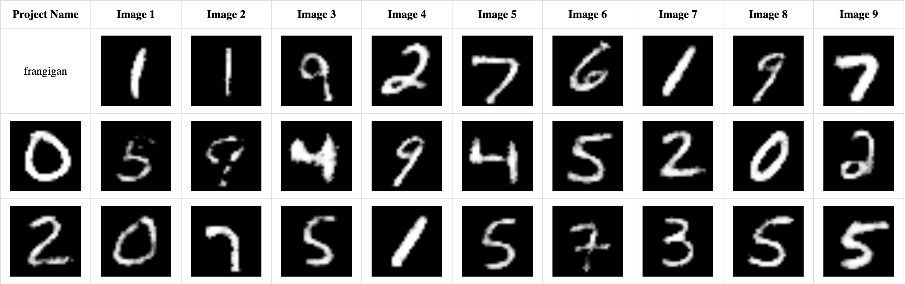
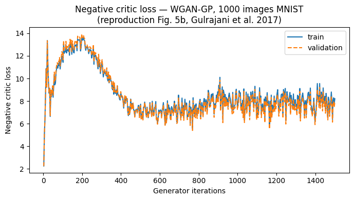

# WGAN-GP with Advanced Latent Space Sampling for MNIST Generation

A PyTorch implementation of **Wasserstein GAN with Gradient Penalty (WGAN-GP)** for high-quality MNIST digit synthesis, featuring four latent space sampling strategies including the paper-based **DOT (Discriminator Optimal Transport)** method.

## Highlights

- WGAN-GP training with spectral normalization + layer normalization in the critic
- EMA (Exponential Moving Average) of generator weights for stable generation
- Four sampling strategies benchmarked: Baseline, Hard Truncation, Soft Truncation, DOT
- DOT implementation from [Tanaka, NeurIPS 2019](https://arxiv.org/abs/1902.01010) — optimizes latent codes via sphere-projected gradient descent
- Evaluation pipeline: FID, Precision, Recall
- Compatible with CUDA, Apple Silicon (MPS), and CPU
- Google Colab notebook for cloud training

## Results

### Generated samples (DOT sampling)



### Quantitative comparison (10,000 samples, v2 model)

| Method | FID ↓ | Precision ↑ | Recall ↑ |
|--------|-------|-------------|----------|
| Baseline z ~ N(0, I) | ~17.1 | 0.61 | 0.31 |
| Hard truncation (ψ=1.5) | ~16.8 | 0.62 | 0.30 |
| Soft truncation (ψ=0.7) | ~16.5 | 0.62 | 0.29 |
| **DOT (N=50, lr=0.01)** | **15.79** | **0.63** | **0.28** |

DOT achieves the best FID and precision. Training was run for **500 epochs** on an NVIDIA GPU (WGAN-GP, n_critic=5, λ=10, Adam β=(0, 0.9)).

### Training curve



## Architecture

### Generator
```
FC: 100 → 256 → 512 → 1024 → 784
Activations: LeakyReLU + tanh output
```

### Critic (WGAN-GP)
```
FC: 784 → 1024 → 512 → 256 → 1
Activations: LeakyReLU, raw logits (no sigmoid)
Regularization: Spectral Normalization + Layer Normalization
```
> Batch normalization is intentionally omitted from the critic — required for the gradient penalty to be valid (penalizes per-sample gradients independently).

## Setup

```bash
pip install -r requirements.txt
```

MNIST is auto-downloaded to `data/` on first run. Pre-trained checkpoints are in `checkpoints/`.

## Usage

### Training

```bash
# WGAN-GP (recommended)
python train.py --epochs 500 --lr 1e-4 --batch_size 64 --mode wgan --n_critic 5 --lambda_gp 10

# Vanilla GAN
python train.py --mode vanilla --epochs 200 --lr 1e-4 --batch_size 64
```

### Generation (10,000 samples → `samples/`)

```bash
# DOT sampling (best quality)
python generate.py --method dot --n_updates 30 --dot_lr 0.01

# Baseline
python generate.py --method baseline

# Soft truncation
python generate.py --method soft_truncation --soft_psi 0.7

# Hard truncation
python generate.py --method hard_truncation --hard_threshold 1.5
```

### Evaluation

```bash
python evaluate.py
```

### Google Colab

Open `colab_train.ipynb` for cloud GPU training (T4/A100 compatible).

## DOT Sampling — Key Idea

DOT (Discriminator Optimal Transport) treats D∘G : Z → ℝ as an approximate dual variable for Wasserstein distance, then transports z toward higher-quality regions:

```
T(z_y) = argmin_z { ‖z − z_y‖₂ − (1/k_eff) · D(G(z)) }
```

Solved by gradient descent with **sphere projection** (for Gaussian prior):
1. Compute gradient g = ∇_z { ‖z − z_y + δ‖₂ − (1/k_eff) · D(G(z)) }
2. Project: g ← g − (g·z)z/√D
3. Update: z ← z − ε·g

k_eff is estimated as `max |D(G(z)) − D(G(z_y))| / ‖z − z_y‖₂` over random pairs.

## References

- Gulrajani et al., *Improved Training of Wasserstein GANs*, NeurIPS 2017 — [[paper]](https://arxiv.org/abs/1704.00028)
- Tanaka, *Discriminator Optimal Transport*, NeurIPS 2019 — [[paper]](https://arxiv.org/abs/1902.01010)

## Cluster Training (Slurm)

```bash
sbatch scripts/train.sh
squeue -u <your_username>
```

See `scripts/train.sh` for full configuration. Update the `--account` and `DATA` path for your cluster.
